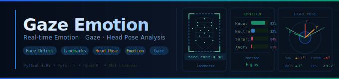

<div align="center">



# 🎯 Gaze Emotion — 视频情绪检测与视线头部分析系统

[](https://www.python.org/)
[](https://pytorch.org/)
[](https://opencv.org/)
[](LICENSE)

**基于计算机视觉与深度学习的视频人脸行为综合分析系统**  
支持情绪识别 · 视线估计 · 头部姿态分析 · 离线视频 / 实时摄像头

[📦 下载程序包](https://drive.google.com/uc?export=download&id=1sH3AfQdfjfLpvcWitlilsO-D0xrYBQbh) · [📄 文档](#使用说明) · [🎬 效果演示](#效果演示)

</div>

---

## 📌 目录

- [项目简介](#项目简介)
- [效果演示](#效果演示)
- [功能特性](#功能特性)
- [环境要求](#环境要求)
- [快速开始](#快速开始)
- [模型下载](#模型下载)
- [使用说明](#使用说明)
- [参数说明](#参数说明)
- [项目结构](#项目结构)
- [应用场景](#应用场景)
- [项目说明](#项目说明)
- [扩展计划](#扩展计划)

---

## 项目简介

**GazeEmotion** 是一套面向视频场景的人脸行为感知系统，融合了人脸检测、面部关键点定位、头部姿态估计、视线方向估计与情绪识别等多项深度学习能力，能够对视频中的目标人物状态进行实时、全面的分析。

系统支持两种工作模式：
- 🎞️ **离线视频检测**：批量处理本地视频文件，自动输出结果
- 📷 **摄像头实时检测**：接入本地摄像头进行持续在线分析

适用于智慧教育、驾驶行为监测、人机交互、心理学研究等多种场景。

---

## 效果演示

| 原始视频 | 处理效果 |
|:---:|:---:|
| [▶ demo.mp4](readme_src/demo.mp4) | [▶ demo_show.mp4](readme_src/demo_show.mp4) |

> 💡 **立即体验（windows）**：[点击下载程序包 →](https://drive.google.com/uc?export=download&id=1sH3AfQdfjfLpvcWitlilsO-D0xrYBQbh)，解压后在本地直接运行即可。

---

## 功能特性

- ✅ 人脸检测与面部关键点精准定位
- ✅ 头部姿态估计（俯仰角 / 偏航角 / 翻滚角）
- ✅ 视线 / 注视方向估计
- ✅ 七类基础情绪识别：`Angry` `Disgust` `Fear` `Happy` `Sad` `Surprise` `Neutral`
- ✅ 离线视频批量处理 + 摄像头实时检测双模式
- ✅ 可视化结果叠加输出，支持多种视频格式
- ✅ 命令行参数灵活配置，易于集成与部署

---

## 环境要求

- Python >= 3.8
- PyTorch >= 1.10
- CUDA（可选，推荐用于加速推理）
- OpenCV >= 4.x

---

## 快速开始

### 1. 克隆项目

```bash
git clone https://github.com/MabelLeeeee/gazeEmotion
cd gazeEmotion
```

### 2. 创建虚拟环境（推荐）

```bash
# 使用 conda
conda create -n emotion python=3.10
conda activate emotion

# 或使用 venv
python -m venv venv
source venv/bin/activate        # Linux / macOS
venv\Scripts\activate           # Windows
```

### 3. 安装依赖

```bash
pip install -r requirements.txt
```

> 如需 GPU 加速，请参考 [PyTorch 官网](https://pytorch.org/get-started/locally/) 安装对应 CUDA 版本的 PyTorch。

### 4. 下载预训练模型

将下载好的模型文件放置于 `weights/` 目录下（详见[模型下载](#模型下载)）：

```
weights/
├── detection_Resnet50_Final.pth
└── PrivateTest_model.t7
```

### 5. 运行

**离线视频检测：**

```bash
python run.py --video input/demo.mp4 --output-dir results/
```

**摄像头实时检测：**

```bash
python run.py --camera 0
```

**使用 GPU 加速：**

```bash
python run.py --video input/demo.mp4 --device cuda --output-dir results/
```

---

## 模型下载

运行本系统前，请下载以下预训练模型并放置于 `weights/` 目录：

| 模型文件 | 大小 | 预训练数据集 | 下载链接 |
|:---:|:---:|:---:|:---:|
| `detection_Resnet50_Final.pth` | 109M | WIDER Face | [下载](https://huggingface.co/nlightcho/gfpgan_v14/resolve/main/detection_Resnet50_Final.pth) |
| `PrivateTest_model.t7` | 77M | 300W (300 Faces In-The-Wild) | [下载](https://drive.google.com/uc?export=download&id=1Oy_9YmpkSKX1Q8jkOhJbz3Mc7qjyISzU) |

---

## 使用说明

### 离线视频检测

1. 将待检测视频文件放入 `input/` 目录
2. 执行以下命令启动分析：

```bash
python run.py --video input/<your_video.mp4> --output-dir results/
```

3. 检测完成后，在 `results/` 目录查看输出结果

### 摄像头实时检测

1. 确认本地摄像头设备工作正常
2. 执行以下命令启动实时检测：

```bash
python run.py --camera 0
```

3. 程序将自动调用摄像头并在窗口中实时显示分析结果，按 `Q` 退出

---

## 参数说明

系统支持通过命令行参数灵活配置运行选项：

| 参数 | 说明 | 示例 |
|:---|:---|:---|
| `--config` | 指定配置文件路径 | `--config configs/default.yaml` |
| `--mode` | 视线估计模型模式 | `--mode L2CS` |
| `--face-detector` | 人脸检测器类型 | `--face-detector retinaface` |
| `--device` | 运行设备 | `--device cuda` / `--device cpu` |
| `--video` | 输入视频文件路径 | `--video input/demo.mp4` |
| `--camera` | 摄像头设备索引 | `--camera 0` |
| `--output-dir` | 结果输出目录 | `--output-dir results/` |
| `--ext` | 输出视频格式 | `--ext mp4` |
| `--no-screen` | 关闭屏幕实时显示 | `--no-screen` |
| `--debug` | 启用调试模式 | `--debug` |

---

## 项目结构

```
gazeEmotion/                                  # 项目根目录
├─ .gitignore                                 # Git 忽略规则
├─ README.md                                  # 当前项目说明文档
├─ readme_old.md                              # 旧版 README 备份
├─ requirements.txt                           # Python 依赖列表
├─ run.py                                     # 主入口脚本（启动离线/实时检测）
├─ assets/                                    # 演示与文档素材
│  ├─ demo.mp4                                # 示例原始视频
│  └─ gaze_emotion.svg                         # 项目相关示意图标
├─ data/                                      # 配置与相机参数数据
│  ├─ calib/                                  # 相机标定参数
│  │  └─ sample_params.yaml                   # 示例相机参数文件
│  ├─ configs/                                # 不同 gaze 模式配置
│  │  ├─ eth-xgaze.yaml                       # ETH-XGaze 配置
│  │  ├─ mpiifacegaze.yaml                    # MPIIFaceGaze 配置
│  │  └─ mpiigaze.yaml                        # MPIIGaze 配置
│  └─ normalized_camera_params/               # 归一化相机参数
│     ├─ eth-xgaze.yaml                       # ETH-XGaze 归一化参数
│     ├─ mpiifacegaze.yaml                    # MPIIFaceGaze 归一化参数
│     └─ mpiigaze.yaml                        # MPIIGaze 归一化参数
├─ models/                                    # 模型定义代码
│  ├─ __init__.py                             # 模型包初始化
│  ├─ vgg.py                                  # VGG 情绪识别模型定义
│  └─ __pycache__/                            # Python 编译缓存（可忽略）
├─ readme_src/                                # README 展示资源
│  ├─ demo.mp4                                # README 用原始演示视频
│  └─ demo_show.mp4                           # README 用处理后演示视频
├─ results/                                   # 推理输出目录
│  ├─ camera/                                 # 摄像头实时模式输出
│  └─ video/                                  # 离线视频模式输出
├─ src/                                       # 核心业务代码
│  ├─ __init__.py                             # src 包初始化
│  ├─ creat_tf.py                             # 数据预处理/transform 构建
│  ├─ demo.py                                 # 推理流程与可视化主逻辑
│  ├─ gaze_estimator.py                       # 视线估计与情绪识别核心
│  ├─ utils.py                                # 工具函数（下载/路径/参数等）
│  ├─ head_pose_estimation/                   # 头姿估计子模块
│  │  ├─ __init__.py                          # 子模块初始化
│  │  ├─ face_landmark_estimator.py           # 人脸关键点估计
│  │  ├─ head_pose_normalizer.py              # 头姿归一化处理
│  │  └─ __pycache__/                         # Python 编译缓存（可忽略）
│  └─ __pycache__/                            # Python 编译缓存（可忽略）
├─ weights/                                   # 本地模型权重
│  └─ PrivateTest_model.t7                    # 情绪识别模型权重
└─ .idea/                                     # PyCharm 工程配置（IDE 文件）
   ├─ .gitignore                              # IDE 目录的忽略规则
   ├─ gazeEmotion.iml                         # PyCharm 模块配置
   ├─ misc.xml                                # PyCharm 基础配置
   ├─ modules.xml                             # PyCharm 模块列表
   ├─ vcs.xml                                 # 版本控制配置
   ├─ workspace.xml                           # 本地工作区配置（个人）
   └─ inspectionProfiles/                     # 代码检查配置
      ├─ profiles_settings.xml                # 检查配置设置
      └─ Project_Default.xml                  # 默认检查规则
```

---

## 应用场景

| 场景 | 描述 |
|:---|:---|
| 🎓 智慧教育 | 课堂专注度分析、学生情绪状态感知 |
| 🚗 驾驶监测 | 驾驶员视线方向与疲劳状态检测 |
| 🤖 人机交互 | 用户情绪与注意力实时反馈 |
| 🧠 心理学研究 | 面部行为数据采集与情绪计算 |
| 📹 视频分析 | 目标人物行为辅助理解与标注 |

---

## 扩展计划

- [ ] 支持多人同时追踪与分析
- [ ] 增加注意力评分与统计报告导出
- [ ] 接入数据库，支持历史数据管理
- [ ] 提供 Web UI 可视化操作界面
- [ ] 支持更多情绪类别与细粒度表情识别
- [ ] 提供 Docker 一键部署支持

---

## 项目说明

项目的详细说明可参考[项目说明](readme_old.md)


---

## License

本项目基于 [MIT License](LICENSE) 开源发布。

